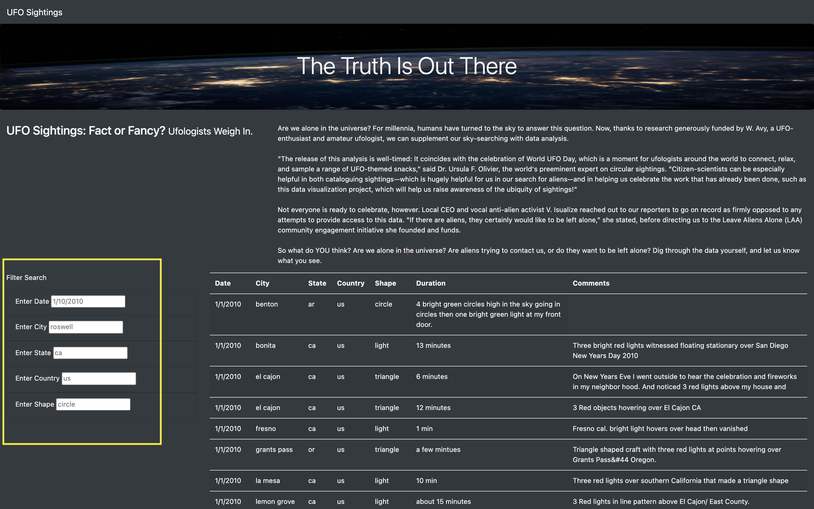
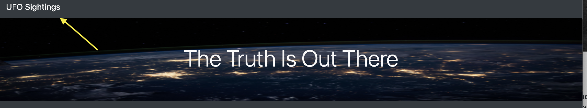
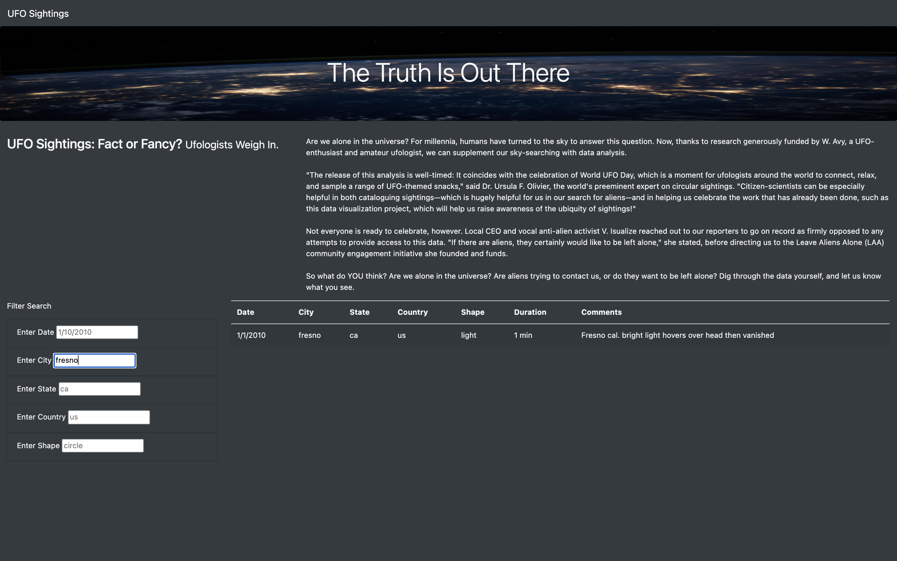

# UFOs
JavaScript

## UFO Sightings Overview 
### Background
Dana, a data journalist, has an opportunity to pick a topic that she wants to write about. Dana has a special interest in UFO sightings, because she is from a town in Oregon that is famous for its sightings called McMinville. Dana has been interested in this topic since childhood.
To write the story, Dana has a javascript file full of information on sightings all over organized by date, city, state, country, shape of boject sighted, and the descirption of the sighting. She has created a webiste with this data that is clean, that functions in giving readers the ability to search for sightings by date.

## Purpose
The purpose of this project is to provide readers with the ability of a more in depth search into the UFO sighting data. Addings filter criteria will allow readers to input values into filters and extract the data in which is desired. The filters that are going to be added in order to have the most precise results are table filters for the city, state, country, and shape of object sighted. Cleaning the website to attain high functionality as well as precision, removing the filter button from Dana's original website, and coding the website to hear the changes in the data by constructing the HTML to refer to a javascript function that will specify what data needs to be returned from the search. 

### Resources

- JavaScript 
  - Javascript is used for the script files that contain the data of sightings and the file that implements the (d3.js) which is the Data-Driven documents library that will allow for more accessible code. 

- HTML
  - HTML will be used to construct the website by implementing Bootstrap elements and CSS styling which will display the website in a formatted way. 
  

### Process
In order to advance Dana's website to be able to filter more specfic data we need to change some things about her wesbite:
  1. We are going to have the data filtered by making the script "hear" the user input data - which is implemented in the app.js script. 
    - the d3.select will be used in order to capture the filters that are going to be used in the filteration of the data table. 
    - this will lead to the d3.selectAll for the input values in order to return the filtered data. 
  2. The filtered data will come from the filtered data function which takes the filters input by the user and vapture the key and value and match the corresponding filtered data. 
  
  3. Formatting the filtered data on the webpage is done through CSS styling. This makes the wesbite visually appealing. This is how the image was added in the header of the website - and the implementation is found in the style.css file. 
  
### Navigating the Wesbite
To filter specific sightings from the website, the user can input a specific date, city, state, country, and shape of object sighted in order to return the data table with only values which match the inputs. 
On the left side of the webpage the user can find the filters with the boxes where the input values are taken and used in filtering what is returned.

After inserting the last input value the user can press 'Enter' to see the precise resulting data table. 

If after user filters the data table, they would like to return back to the unfiltered data, there is a quick return button imbeded into the HTML. 
In the upper left-hand corner of the website users can find the words "UFO Sightings" - clicking this will return to the unfiltered data page that looks like the image in the Background section above due to its fucntion being to reload the webpage. 

#### Example of filtering the data 

If the user wanted to see all the sigtings in the data table that are in California on 1/4/2010 then the filter inputs and resulting filtered data table would look like :

The above filter is able to happen due to the script app.js and its functionality within the HTML file. 

## Summary

### Drawbacks to the Webpage 

There is a particularly evident drawback to this webpage due to Javascript being case sensitive - the format of the user input must match the format of the placeholder that is orignially in the filters. 
When inputing a filter if you want to enter a filter for a city name - all letters must be lowercase in order to get the correct filteration. 

If you want to filter for the sightings in the city 'Fresno' - if you type in "Fresno" the data will return:

The filtered data table that is returned is empty because the input "Fresno" does not match any city since it is not correctly formatted. Javascript is a case sensitive langauge so the input format has to match exactly.

The correct filter with input 'fresno' is:

### Recommendations for Further Development

This website could be futher developed in order to inlcude a more managable filteration of the shape of the object sighted.
The shape section of the data is as obvious of a filter as the others.
In order to make the shape a more managable search option - the website could potentially include a drop down menu of the list of possible shapes that could be filtered in the dataset.
This would make the filtering based on shape more manageable ebcause the user can specify the specific input value that is in the data table and not have to guess the format for each shape. 

Another futher development that this website could implement is being able to download the specified data table from the filter that the user conducts. Adding a download button would provide Ufologists with more data to study and continue analysis on this data that can continue to grow the data table. 

These implementations would only futher the functionality of the website because it would provide users with more access to more information.

